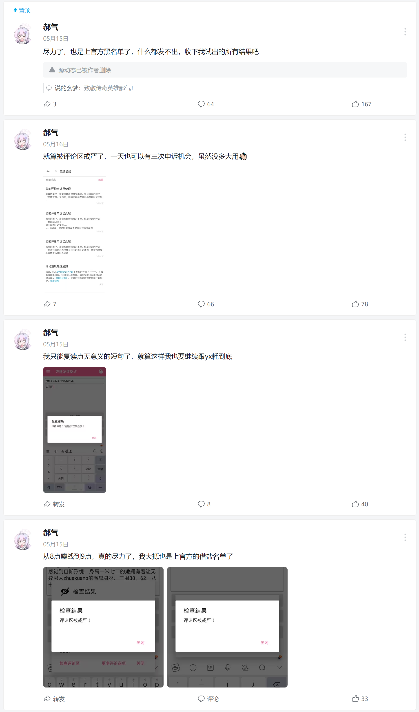
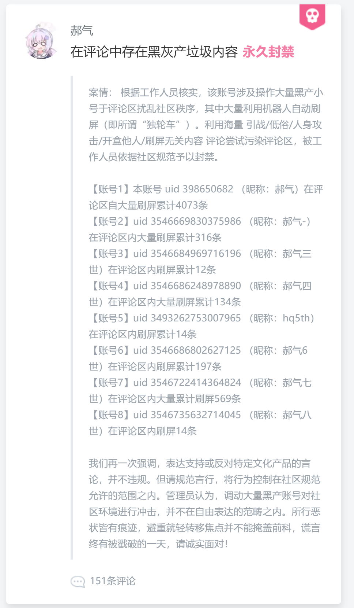

# 哔哩发评反诈
发送评论后自动检查评论是否正常的Xposed模块。避免你的评论被仅自己可见或者被秒删了还给系统“发送成功”的谎言所欺骗，恢复在阿瓦隆系统下你对评论状态的知情权！  
同时帮你记录所发布的评论，拒绝遗忘！

# 简要使用说明
## 账号

对于评论的检查，需要获取对应UID对应账号cookie进行检查。需要在账号管理器中添加对应账号。

### 自动获取b站客户端cookie

自动获取哔哩哔哩客户端的cookie，检查时自动添加对应的账号到用户列表，无需手动添加账号。

cookie来源于webview中的cookies数据库，若该cookie无法使用可关闭该功能。

### 手动添加账号

右上角小饼干（旧版本的cookie设置），账号列表，添加账号。你可以在内置浏览器进行登录获取cookie，或者你通过别的方式获取到cookie（列如从Chrome抓取到的），填写完毕后完成以添加账号。

### 更新账号

若账号cookie失效，可在账号列表点击账号，获取新的cookie填写上去并更新

### 账号的评论区

填写自己发布内容的评论区地址，可以是你所发布的视频、动态、专栏，请勿填别人的。由检查评论是否只在当前评论区被Ban、扫描敏感词，这两个功能所使用

### 之前版本的小号

> 由于阿瓦隆的“查重黑名单”、“反刷屏”、账号风控……等机制，前面发送的评论可能会“污染了评论区”，导致检查评论区是否戒严时会把正常的评论区判定为戒严。此时可以用小号来检查，以避免主号发送评论所带来的影响，使评论区戒严检测的结果更精确（前提是你小号没被风控）。

检查评论区、扫描敏感词等功能所使用。6.0.0版本之后引入了多账号，旧概念已废除，现小号指的是非当前被检查评论所属发送者的账号。

## 检查与统计

在哔哩哔哩APP里评论发送成功后，会调起本发评反诈进行检查，并在上面显示的对话框展示进度与检查结果。  

### 评论8种状态

- 评论正常
- 仅自己可见
- 被系统秒删
- 包含敏感词
- 评论被隐身（invisible）
- 评论疑似审核
- 评论疑似正常（申诉时提示无可申诉评论时状态会切换为此）
- 未知状态（直接去申诉无法得知状态）

遇到评论疑似审核的，建议使用『监控评论』功能，后台1分钟检查一次，状态发生变化时通知提醒你。当然出现疑似审核的原因也可能是评论区有戒严，评论应该是扔给更复杂的AI审核（少些评论区是人工），耗时较高（几乎持平视频的AI审核）

当然，b站对于被ban的评论你还可以去[申诉](https://www.bilibili.com/h5/comment/appeal)，如果评论没毛病，多数时候是可以恢复正常显示的（当然你得自己发现评论是否异常🙃）。本软件集成了申诉功能，评论不能正常显示时可在对话框内选择[更多评论选项]==>[申诉]。

开启历史记录功能可记录所有评论以及检查时发现戒严的评论区。借助历史评论记录可帮助你分析它爱ban什么评论，以及你的评论被ban率有多高。同时也是你的“小日记”，记录你的评论使其不被遗忘。同时对于“你的评论[hell\*\*]已被移除”的智障隐私保护，能帮你找到目标评论

刚开始的时候（v1.0.0）并没有作为Xposed模块，要复制评论bv号，并在发评反诈里输入评论再发送进行检查。发送评论多了个复制bv号或链接的步骤，较为麻烦，但是开发了Xposed功能就舒服多了。  

**详细使用教程与说明请查看本github项目主页**，一定得先了解哔哩哔哩的「阿瓦隆」系统！

## 保证支持的版本
- 国内版已适配版本
    - ? - 7.25.0 - 7.27.0
    - 7.28.0 - 7.33.0
    - 7.34.0
    - 7.35.0 - ? 
    - ~7.68.0~
- 国际版已适配版本：
    - ? - 3.16.0 - ？
# 下载
https://github.com/freedom-introvert/biliSendCommAntifraud/releases
# 关于之前LSPosed仓库删档

有很多群友反馈，发布更新了，但是LSPosed仓库未提示有更新，同时安装了也没显示“*已安装*”。

才发现，lsp仓库里显示的是全小写的包名`icu.freedomintrovert.bilisendcommantifraud`，而软件真正的包名是`icu.freedomIntrovert.biliSendCommAntifraud`，导致LSP没匹配到已安装的模块。我想单独建一个与包名正确对应的新仓库，并保留原来的。但由于submission不区分大小写包名，提交时提示重复，只能删库重建，需要了解历史版本更新信息的可移步项目源地址。

首次上传时没注意，很抱歉给大家带来了那么多麻烦。

# 完整使用说明/GitHub项目

https://github.com/freedom-introvert/biliSendCommAntifraud
## 关于
### 讨论交流
Telegram: [@biliSendCommAntifraud](https://t.me/biliSendCommAntifraud)
### LOGO含义
来自：Never Gonna Give You Up - Rick Astley  
意为“发送成功”但是你被骗了🤪
### 关于转载
该模块仅在Xposed module repo官方仓库发布，请不要在哔哩哔哩以视频动态专栏宣传本模块！更不要在推特宣传本模块！其他平台随意，但也要考虑情况（比如小绿书慎重考虑）。**转发包括readme一起请注意潜在的敏感信息，比如测试“包含敏感内容”的64，不然你的网站或者是号要没了哦:(**
### 使用守则

严禁在b站公开区域宣传与展示本软件，尤其是视频、动态、文章！

### 用户耻辱柱

UID：398650682

公开在个人动态中宣传哔哩发评反诈，并且被官方关进小黑屋。

##  插曲
### 百度搜索
请不要过度在百度搜索此模块名称：“哔哩发评反诈”，已造成不良影响了😅。

### 命名与国家反诈中心
由于本应用的名称包含“反诈”一词，在受国家反诈中心监控的手机里，**被误以为是假冒国家反诈中心**，所以会有安装导致被反诈中心打电话😰。群里有真实被打电话的案例，但他却没有安装反诈中心。手机是MIUI14的系统，看来MIUI内置国家反诈中心的传闻并非危言耸听。究其原因是“应用包管理组件”上传了你所安装应用的信息，接着会传给MIUI服务器然后再发给真的反诈中心，手机号码绑定了小米账号，反诈中心就会根据这个手机号给你打电话。**安装时记得断网，避免被上传信息**！如果你怕会后台偷偷上传，那么聪明的你可以去找些屏蔽系统应用联网的模块，把一切所谓“保护安全”的应用禁止联网😉。
## 我的另一个作品与嘲讽
### [YouTube发评反诈](https://github.com/freedom-introvert/YouTubeSendCommentAntiFraud)  
没错，油管发评反诈，YouTube版阿瓦隆！他不仅把阿瓦隆完整的抄了一遍，甚至能做得比b站更绝！b站可恶之处只在于隐评删评，YouTube可恶之处不止隐评删评，部分评论还会不让出现在“热门”列表里，接着热门的列表还故意让那些它认为偏向夸赞的评论排在前面（如“暖心”），有些评论即使点赞多的，但是不够暖心但它也会被排到后面去。所以为什么YouTube的评论区都是夸赞一边倒的，似乎看不到骂与批评。   

你阿美莉卡说的言论自由何存呢？我们小粉红最喜欢看你们闹笑话了🤣👉🤡   

_ps：当然对于热门列表的相关检测暂未支持，因为没啥人用，我不想多费力气，想要的话去YouTube发评反诈的仓库发issues，我立即编写代码更新_